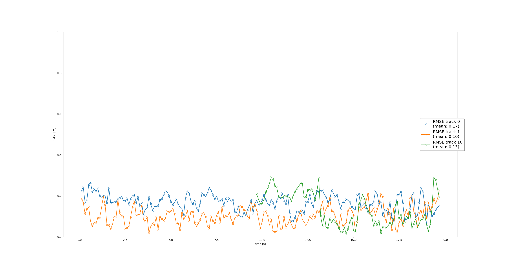

## Final project

### Step 1 - EKF implementation

First of the final project was about implementing Extended Kalman Filter to track single target with lidar measurement. EKF was implemented and can be used to track the vehicle. Possible improvements would be to use different motion model (e.g. bicycle model) or adjusting process noise covariance (according to the scenarios).

RMSE for single target tracking:

Tracked object:

### Step 2 - Track Management

Second step was focused on track management: initializing, deleting, setting track state and track score.
All instructions were implemented and results can be seen by following the life-cycle of the track.

### Step 3 - Data Association

Third step involved implementation of SNN (Single Nearest Neighbor) to associate measurements with tracks. This allows us to perform multi-target tracking. Mahalanobis distance and gating are used to make sure that we are only checking reasonable associations.

### Step 4 - Sensor Fusion

Last part of the project was to implement nonlinear camera measurement model. This will enable actual sensor fusion, since both lidar and camera will be used.

RMSE for multi-target tracking with sensor fusion:

### Q&A

*Do you see any benefits in camera-lidar fusion compared to lidar-only tracking (in theory and in your concrete results)?*

First benefit of using multiple sensors is their different field-of-views. Even if the vehicle is occluded for one of the sensors, there is still possibility that the others will be able to measure its position. The same goes for failure of one of the sensors, or even partial occlusion due to dirt on the lens.
Lidar and camera are also using different technique for measurement. Lidar doesn't require external light source, so it should in general perform better in low-light conditions. It's also capable of accurate distance measurement and can provide intensity (which might be useful for features extraction). Camera should be able to measure lateral movement of the vehicle pretty well. It is also present in the world of automotive industry since quite some time, so many of the solutions are already implemented (like pre-trained neural networks for car recognition).
In the results from the final project we can see much lower RMSEs when using camera measurements. I suspect that it comes from: a) more measurements available for the EKF b) better lateral motion estimation.

*Which challenges will a sensor fusion system face in real-life scenarios? Did you see any of these challenges in the project?*

One problem is definitely sensor mounting and its alignment. In case of single sensor, that is misaligned, we will just get the offset on the track position. Using multiple sensors might lead to wider spread of the measurement, therefore bigger uncertainty of track position. 
Second, similar issue, might come from timing and latencies. For example one of the sensors might have longer processing time and therefore reports track position with delay. This would influence the results of EKF as well.
Issue that I noticed in the final project is that there are quite a lot of false positives (bushes detected as vehicles), which results in the initilized tracks. This is however handled pretty well, as the tracks are not transformed confirmed state and gets deleted after a while.

*Can you think of ways to improve your tracking results in the future?*

Neural network for camera measurements could be improved to reduce number of false positives.
Additional sensors from Waymo dataset could be used to increase number of measurements and reduce occlusions.
Different motion model could be used to improve tracking vehicles (e.g. bicycle model).

