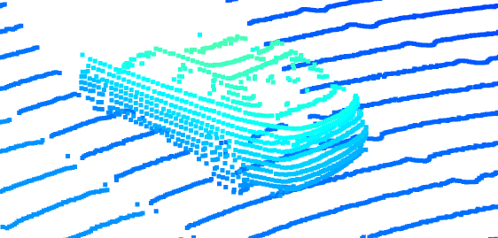

## Mid-Term project

### ID_S1_EX1 - Visualize range image channels 

Visualization for range and intensity channels:

### ID_S1_EX2 - Visualize lidar point-cloud

Lidar point cloud visualization:

Example of cars with different visibility. As we can see some vehicles are visible only from front/side/rear and with different occlusion level.

Some features that are visible for most of the vehicles:
* roof (as it is rarely occluded, due to lidar sensor mounting point)
* wheels (for side viewed vehicles), 
* license plates (high reflectivity),
* lamps (additional source of light).

### ID_S2_EX1 - Create Birds-Eye View from Lidar PCL

Visualization: \

### ID_S2_EX2 - Compute intensity layer of the BEV map

Visualization of intensity layer: \

### ID_S2_EX3 - Compute height layer of the BEV map

Visualization of height layer: \

### ID_S3_EX1 - Add a second model from a GitHub repo

Inspection of detections variable: \

### ID_S3_EX2 - Extract 3D bounding boxes from model response 

Visualization of bounding boxes: \

### ID_S4_EX1 - Extract 3D bounding boxes from model response 

### ID_S4_EX2 - Compute false-negatives and false-positives

### ID_S4_EX3 - Compute precision and recall

precision = 0.9620689655172414 \
recall = 0.9117647058823529 

